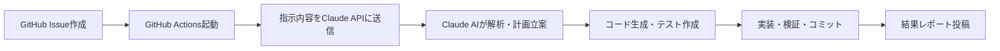

# Claude AI Actions セットアップガイド

## 🚀 真のClaude API統合システム

このガイドでは、Claude API を使用した真のAI統合システムのセットアップ方法を説明します。

## 🔑 必要な設定

### 1. Claude API キーの取得

1. **Anthropic Console にアクセス**
   - https://console.anthropic.com/ にアクセス
   - アカウントでログイン

2. **API キーを生成**
   - 「API Keys」セクションに移動
   - 「Create Key」をクリック
   - キー名を入力（例：`tdd-sample-github-actions`）
   - 生成されたキーをコピー **（このキーは一度しか表示されません）**

3. **使用量制限の確認**
   - Maxプランの場合、十分な API クレジットが利用可能
   - 使用量はConsoleで監視可能

### 2. GitHub Secretsの設定

1. **GitHubリポジトリに移動**
   ```
   https://github.com/YuichiNohara24365fw/tdd-sample
   ```

2. **Settings → Secrets and variables → Actions**

3. **新しいシークレットを追加**
   - Name: `CLAUDE_API_KEY`
   - Secret: (上記で取得したClaude APIキー)
   - 「Add secret」をクリック

### 3. ワークフロー権限の設定

1. **Settings → Actions → General**

2. **Workflow permissions**
   - ✅ Read and write permissions を選択
   - ✅ Allow GitHub Actions to create and approve pull requests

## 🔧 システムアーキテクチャ

### Claude AI統合フロー


### 主要コンポーネント

#### 1. **インテリジェント指示解析**
```yaml
# Claude API Request
{
  "model": "claude-3-5-sonnet-20241022",
  "system": "Expert software developer integrated with GitHub Actions",
  "messages": [{"role": "user", "content": "ユーザーの自然な指示"}]
}
```

#### 2. **構造化レスポンス**
```json
{
  "action_type": "generate|test|review|refactor|documentation",
  "analysis": "要求の分析結果",
  "implementation_plan": "段階的実装計画",
  "code_files": [{"path": "ファイルパス", "content": "完全なコード"}],
  "test_files": [{"path": "テストパス", "content": "完全なテスト"}],
  "commands": ["実行すべきコマンド"],
  "explanation": "ユーザー向け詳細説明"
}
```

#### 3. **自動実装・検証**
- コードファイルの動的生成
- テストファイルの自動作成
- リント・テスト・カバレッジの実行
- Git コミット・プッシュ

## 🎯 使用方法

### 基本的な指示例

#### 1. **自然な言葉でのクラス作成**
```markdown
タイトル: [CLAUDE] ArrayUtils クラス
本文: 配列操作のユーティリティクラスを作ってください。重複除去、合計、平均値の機能が欲しいです。
```

#### 2. **具体的な機能追加**
```markdown
タイトル: ユーザー認証機能
本文: 
ログイン・ログアウト・セッション管理ができる認証システムを実装してください。
- JWT トークン使用
- パスワードハッシュ化
- セキュリティ対策込み
```

#### 3. **テスト改善指示**
```markdown
タイトル: テストカバレッジ改善
本文: 現在のテストカバレッジを確認して、不足している部分のテストを追加してください。エッジケースも含めて100%を目指してください。
```

#### 4. **コードレビュー依頼**
```markdown
タイトル: セキュリティレビュー
本文: プロジェクト全体をセキュリティの観点でレビューしてください。脆弱性があれば修正案も提示してください。
```

### 高度な使用例

#### 1. **アーキテクチャ改善**
```markdown
タイトル: クリーンアーキテクチャ導入
本文:
現在のコードをクリーンアーキテクチャに沿って整理してください：
- レイヤー分離（Presentation, Business, Data）
- 依存性逆転の適用
- テスタビリティの向上
```

#### 2. **パフォーマンス最適化**
```markdown
タイトル: パフォーマンス改善
本文:
アプリケーションのパフォーマンスを分析・改善してください：
- ボトルネックの特定
- アルゴリズムの最適化
- メモリ使用量の削減
- ベンチマークテストの追加
```

## 🔒 セキュリティ考慮事項

### 1. **API キー管理**
- ✅ GitHub Secrets に保存
- ✅ 環境変数として使用
- ❌ コードに直接記述しない
- ❌ ログに出力しない

### 2. **権限制御**
```yaml
permissions:
  contents: write      # コード変更用
  issues: write        # Issue管理用
  pull-requests: write # PR管理用
  # 最小限の権限のみ付与
```

### 3. **実行制限**
- リポジトリオーナーまたは指定ユーザーのみ実行可能
- 過度なAPI使用量の制限
- 実行ログの監視

## 📊 コスト管理

### Claude API使用量目安
- **1回の実行**: 約1,000-4,000トークン
- **月間100回実行**: 約200,000-400,000トークン
- **Maxプランでの余裕**: 十分なクレジット利用可能

### 使用量最適化
```yaml
# 効率的なプロンプト設計
"max_tokens": 4000,  # 必要最小限に設定
"model": "claude-3-5-sonnet-20241022"  # 最適なモデル選択
```

## 🚀 従来システムとの比較

| 項目 | 従来システム | Claude AI統合 |
|------|-------------|---------------|
| **指示方法** | 固定キーワード必須 | 自然言語で自由 |
| **理解力** | パターンマッチング | AI による意図理解 |
| **コード生成** | 固定テンプレート | 動的・適応的生成 |
| **柔軟性** | 限定的 | 無制限 |
| **学習能力** | なし | 文脈理解・改善 |

## 🛠️ トラブルシューティング

### よくある問題

#### 1. **API キーエラー**
```
Error: Claude API authentication failed
```
**解決方法:**
- GitHub Secrets の `CLAUDE_API_KEY` を確認
- APIキーの有効性をConsoleで確認

#### 2. **トークン制限エラー**
```
Error: Token limit exceeded
```
**解決方法:**
- 指示を簡潔にする
- 大きなファイルは分割して処理

#### 3. **権限エラー**
```
Error: Permission denied
```
**解決方法:**
- Workflow permissions を確認
- トークンの権限設定を確認

### デバッグ方法

#### 1. **実行ログの確認**
- GitHub Actions の実行ログを確認
- Claude API レスポンスをチェック

#### 2. **段階的テスト**
```markdown
タイトル: [CLAUDE] テスト
本文: Hello Claude! 簡単なテストをしてください。
```

## 🎯 成功のベストプラクティス

### 1. **効果的な指示の書き方**
- **明確な目的**: 何を達成したいかを具体的に
- **詳細な要件**: 必要な機能や制約を明記
- **品質基準**: テストカバレッジやセキュリティ要件
- **段階的指示**: 複雑なタスクは小さく分割

### 2. **継続的改善**
- **実行結果の確認**: Claude の提案を検証
- **フィードバック**: 改善点があれば次回指示に反映
- **学習**: Claude の能力を理解し活用

### 3. **チーム活用**
- **標準化**: チーム全体で統一した指示方法
- **知識共有**: 効果的な指示例の共有
- **役割分担**: AI と人間の適切な役割分担

## 🚀 次のステップ

1. **API キー設定**: 上記手順でClaude APIキーを設定
2. **テスト実行**: 簡単な指示でシステムをテスト
3. **本格運用**: 実際の開発タスクでClaude AIを活用
4. **最適化**: 使用状況に応じてプロンプトや設定を改善

これで真のClaude Code Actionsが利用可能になります！