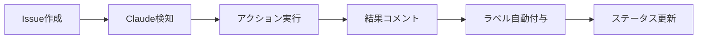

# GitHub統合完全ガイド - Claude Code Actions連携

## 🎯 概要

このガイドでは、Claude Code ActionsとGitHubの各機能（Issues、Pull Requests、Actions、Projects等）との詳細な連携方法を説明します。効果的なチーム開発とCI/CDパイプラインの構築により、開発プロセス全体を自動化・最適化できます。

## 🔧 GitHub機能とClaude Code Actionsの関連性

### 1. **GitHub Issues ↔ Claude Code Actions**

#### 基本的な連携フロー


#### Issues トリガー設定
```yaml
# .github/workflows/claude-universal.yml
on:
  issues:
    types: [opened, edited, labeled]  # Issue作成・編集・ラベル付与時
  issue_comment:
    types: [created, edited]         # コメント作成・編集時
```

#### Issue活用パターン

**1. 機能開発Issue**
```markdown
タイトル: [CLAUDE] 新機能: ユーザー認証システム
本文:
以下の認証機能をTDDで実装してください：

**仕様:**
- ユーザー登録・ログイン・ログアウト
- JWT トークン認証
- パスワードハッシュ化

**要件:**
- 100% テストカバレッジ
- セキュリティベストプラクティス適用
- API ドキュメント自動生成

ラベル: enhancement, security, high-priority
```

**2. バグ修正Issue**
```markdown
タイトル: [CLAUDE] バグ修正: 計算結果の精度問題
本文:
Calculator.divide() メソッドで浮動小数点の精度問題が発生しています：

**現象:**
- 0.1 + 0.2 が 0.30000000000000004 になる
- 期待値: 0.3

**修正要求:**
- 精度問題の修正
- 既存テストの保護
- 新しいテストケース追加

ラベル: bug, calculator, medium-priority
```

**3. コードレビューIssue**
```markdown
タイトル: [REVIEW] 週次コード品質チェック
本文:
プロジェクト全体のコード品質を確認してください：

**レビュー観点:**
- セキュリティ脆弱性
- パフォーマンス問題
- コード重複
- テストカバレッジ

ラベル: code-review, quality-check
```

### 2. **GitHub Pull Requests ↔ Claude Code Actions**

#### PR連携設定
```yaml
on:
  pull_request:
    types: [opened, synchronize, reopened]
```

#### 自動PR分析
```markdown
# PR タイトル例
[CLAUDE] Feature: 配列操作ユーティリティの追加

# PR説明
ArrayUtilsクラスの新機能追加PRです。
以下の機能を実装しました：
- unique(): 重複要素の除去
- sum(): 配列要素の合計
- average(): 平均値計算

@claude この実装をレビューしてください。
```

#### PR自動処理フロー
1. **PR作成** → Claude Actions自動実行
2. **コードレビュー** → 品質分析結果をコメント
3. **テスト実行** → カバレッジレポート生成
4. **承認可否** → 品質基準に基づく自動判定

### 3. **GitHub Actions ↔ Claude Code Actions**

#### ワークフロー統合アーキテクチャ
```yaml
# CI/CD パイプライン統合
name: Comprehensive CI/CD with Claude
on:
  push:
    branches: [main, develop]
  pull_request:
    branches: [main]
  issues:
    types: [opened, edited]

jobs:
  # 標準CI/CD
  standard-ci:
    runs-on: ubuntu-latest
    steps:
      - name: Run Tests
        run: npm test
      - name: Build Application  
        run: npm run build

  # Claude Code Actions
  claude-integration:
    runs-on: ubuntu-latest
    if: contains(github.event.issue.title, '[CLAUDE]')
    steps:
      - name: Execute Claude Actions
        uses: ./.github/workflows/claude-universal.yml
```

#### 並行実行とパイプライン最適化
```yaml
jobs:
  # 並行実行でパフォーマンス向上
  test-matrix:
    strategy:
      matrix:
        node-version: [18, 20, 22]
        os: [ubuntu-latest, windows-latest, macos-latest]
    runs-on: ${{ matrix.os }}
    
  claude-analysis:
    runs-on: ubuntu-latest
    # test-matrixと並行実行
    
  security-scan:
    runs-on: ubuntu-latest
    # その他のジョブと並行実行
```

### 4. **GitHub Projects ↔ Claude Code Actions**

#### プロジェクト管理との連携
```markdown
# プロジェクトボード自動更新
## バックログ
- [ ] [CLAUDE] 新機能A実装
- [ ] [CLAUDE] 新機能B実装

## 進行中  
- [x] [CLAUDE] 機能C実装中

## 完了
- [x] [CLAUDE] 機能D実装完了 ✅
```

#### 自動ステータス更新
```javascript
// プロジェクトカード自動移動
await github.rest.projects.moveCard({
  card_id: cardId,
  position: 'top',
  column_id: inProgressColumnId
});
```

### 5. **GitHub Packages ↔ Claude Code Actions**

#### 成果物の自動公開
```yaml
- name: Publish Package
  if: success() && github.ref == 'refs/heads/main'
  run: |
    npm version patch
    npm publish
    git push --tags
```

## 📊 高度なGitHub統合パターン

### 1. **多段階承認ワークフロー**

#### 段階的レビュープロセス
```yaml
name: Multi-Stage Review
on:
  pull_request:
    types: [opened]

jobs:
  automated-review:
    runs-on: ubuntu-latest
    steps:
      - name: Claude Auto Review
        # 自動レビュー実行
      - name: Request Human Review
        if: needs.automated-review.result == 'failure'
        # 人間のレビューが必要な場合
```

#### 承認フロー管理
```markdown
# 自動承認条件
- ✅ Claude レビューパス
- ✅ 全テストパス  
- ✅ カバレッジ100%
- ✅ セキュリティスキャンパス

# 手動承認が必要
- ❌ 破壊的変更を含む
- ❌ 新しい依存関係追加
- ❌ パフォーマンス影響大
```

### 2. **環境別デプロイ管理**

#### 環境固有の Claude Actions
```yaml
# 開発環境向け
development-claude:
  if: github.ref == 'refs/heads/develop'
  environment: development
  
# ステージング環境向け  
staging-claude:
  if: github.ref == 'refs/heads/staging'
  environment: staging
  
# 本番環境向け
production-claude:
  if: github.ref == 'refs/heads/main'
  environment: production
  needs: [security-review, performance-test]
```

### 3. **インシデント対応自動化**

#### 緊急対応Issue
```markdown
タイトル: [CLAUDE][URGENT] 本番環境エラー対応
本文:
本番環境で以下のエラーが発生しています：

**エラー詳細:**
- Error: Division by zero in Calculator.divide()
- 発生時刻: 2024-01-15 10:30 JST
- 影響範囲: 全ユーザー

**対応要求:**
1. 緊急パッチの作成
2. テストケース追加
3. デプロイ準備
4. 原因分析レポート

優先度: P0 (最高)
```

#### 自動緊急対応
```yaml
urgent-response:
  if: contains(github.event.issue.labels.*.name, 'P0')
  runs-on: ubuntu-latest
  steps:
    - name: Emergency Analysis
      # 緊急分析実行
    - name: Create Hotfix
      # ホットフィックス作成
    - name: Notify Team
      # チーム通知
```

## 🔒 セキュリティとアクセス制御

### 1. **権限管理**

#### 最小権限の原則
```yaml
permissions:
  contents: write      # コード変更用
  issues: write        # Issue管理用  
  pull-requests: write # PR管理用
  # packages: write    # 不要な権限は付与しない
  # admin: write       # 管理権限は最小限
```

#### シークレット管理
```yaml
env:
  CODECOV_TOKEN: ${{ secrets.CODECOV_TOKEN }}
  NPM_TOKEN: ${{ secrets.NPM_TOKEN }}
  # API_KEY: ${{ secrets.API_KEY }}  # 機密情報は環境変数で管理
```

### 2. **監査とコンプライアンス**

#### 実行履歴の保存
```yaml
- name: Log Execution
  run: |
    echo "Action: ${{ github.event.action }}" >> audit.log
    echo "User: ${{ github.actor }}" >> audit.log  
    echo "Time: $(date)" >> audit.log
    git add audit.log && git commit -m "Audit: ${{ github.event.action }}"
```

#### コンプライアンスチェック
```yaml
compliance-check:
  runs-on: ubuntu-latest
  steps:
    - name: License Check
      # ライセンス互換性確認
    - name: Security Scan  
      # セキュリティスキャン
    - name: Data Privacy Check
      # プライバシー要件確認
```

## 📈 メトリクスと分析

### 1. **パフォーマンス指標**

#### GitHub API使用量監視
```javascript
const rateLimitStatus = await github.rest.rateLimit.get();
console.log(`Remaining: ${rateLimitStatus.data.rate.remaining}`);
```

#### 実行時間分析
```yaml
- name: Performance Monitoring
  run: |
    start_time=$(date +%s)
    npm test
    end_time=$(date +%s)
    duration=$((end_time - start_time))
    echo "Test execution time: ${duration}s"
```

### 2. **品質メトリクス**

#### 自動品質レポート
```markdown
## 📊 週次品質レポート

### Claude Actions実行統計
- 総実行回数: 45回
- 成功率: 95.5%
- 平均実行時間: 2.3分

### コード品質指標  
- テストカバレッジ: 98.5%
- バグ検出率: 12件/週
- リファクタリング頻度: 8回/週

### チーム生産性
- Issue解決時間: 平均1.2日
- PR レビュー時間: 平均4時間
- デプロイ頻度: 週3回
```

## 🚀 スケーラビリティとパフォーマンス

### 1. **大規模プロジェクト対応**

#### 並行処理最適化
```yaml
jobs:
  test-parallel:
    strategy:
      matrix:
        test-group: [unit, integration, e2e]
    steps:
      - name: Run ${{ matrix.test-group }} tests
        run: npm run test:${{ matrix.test-group }}
```

#### キャッシュ戦略
```yaml
- name: Cache Dependencies
  uses: actions/cache@v3
  with:
    path: ~/.npm
    key: ${{ runner.os }}-node-${{ hashFiles('**/package-lock.json') }}
    restore-keys: |
      ${{ runner.os }}-node-
```

### 2. **リソース最適化**

#### 条件付き実行
```yaml
- name: Run only if needed
  if: |
    contains(github.event.head_commit.message, '[skip ci]') == false &&
    (github.event_name == 'push' || 
     contains(github.event.pull_request.changed_files, 'src/'))
```

#### 実行時間制限
```yaml
jobs:
  claude-action:
    runs-on: ubuntu-latest
    timeout-minutes: 10  # 最大10分で終了
```

## 🔄 継続的改善

### 1. **フィードバックループ**

#### 自動改善提案
```markdown
タイトル: [CLAUDE] ワークフロー最適化提案
本文:
過去1週間の実行データを分析した結果、以下の最適化を提案します：

**改善点:**
1. テスト実行時間が20%増加 → 並行化の検討
2. PR レビュー時間が長期化 → 自動チェック強化
3. デプロイ失敗率が5%上昇 → 事前検証の追加

**推奨アクション:**
- 並行テスト実行の導入
- より厳密な事前チェック
- ロールバック機能の強化
```

### 2. **A/Bテスト**

#### ワークフロー改善実験
```yaml
experiment-a:
  if: github.event.number % 2 == 0
  # 既存ワークフロー
  
experiment-b:  
  if: github.event.number % 2 == 1
  # 新しいワークフロー
```

## 🎯 ベストプラクティス総まとめ

### 1. **効果的なGitHub統合**
- **明確な命名規則**: Issue、PR、ブランチの統一命名
- **適切なラベル管理**: 自動処理とマニュアル操作の分離
- **段階的自動化**: 手動→半自動→完全自動の段階的移行

### 2. **チーム協力の最適化**
- **透明性**: 全実行結果の可視化
- **責任分担**: 自動化とレビューの役割分離  
- **継続的学習**: 実行結果からの知見共有

### 3. **運用の持続可能性**
- **監視**: パフォーマンスと品質指標の継続監視
- **改善**: 定期的なワークフロー見直し
- **拡張**: 新機能・新要件への柔軟な対応

Claude Code ActionsとGitHubの統合により、開発プロセス全体が自動化され、チーム全体の生産性と品質が大幅に向上します。この統合システムは、個人開発からエンタープライズ規模まで、あらゆる規模のプロジェクトに適用可能です。